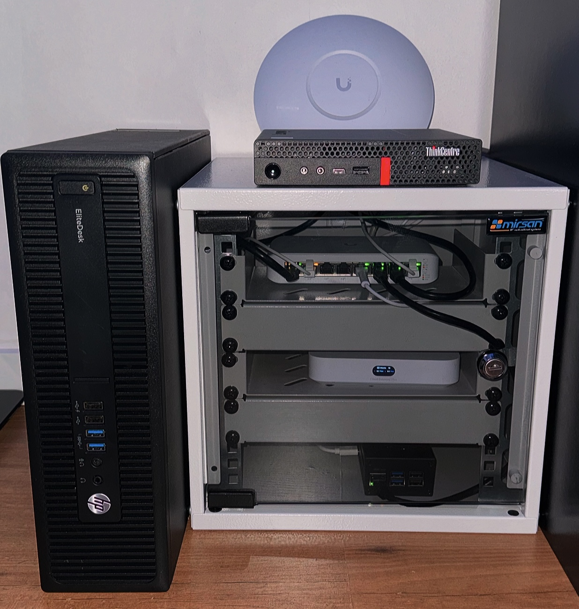

# 👨🏽‍💻 Cybersecurity Portfolio - Nicky Jacobs

Welcome to my cybersecurity portfolio. My name is **Nicky Jacobs**, born on **Curaçao** and currently living in the **Netherlands**.

I value making good use of my time and consider myself an open-minded person. I enjoy doing meaningful and fun things like going to festivals with friends, grabbing drinks on a terrace, visiting museums and art galleries, and exploring new activities. I also love traveling, visiting new countries and continents to discover what more the world has to offer.

I love listening to music and I always enjoy a good film, series, or documentary. I like working out and I’m currently learning **Spanish**. 
Every day, I strive to become the best version of myself, mainly for myself, but also for the people who matter to me.

---

## My Passion for Cybersecurity

I'm deeply passionate about **IT**, especially **cybersecurity**. It’s something I invest a lot of time into and gladly so.

My favorite podcast is _Risky Business_ by Patrick Gray. I follow cybersecurity news via **WIRED**, **NCSC** and I also enjoy **Darknet Diaries**.

To build hands-on skills, I’ve developed a **homelab** and collected various tools and setups, including:
- A laptop with a **Kali Linux VM**
- **Flipper Zero** (with WiFi and Bluetooth add-ons)
- **WiFi Pineapple Mark VII Tactical** for WiFi pentesting
- Several bootable USBs with **Tails**, **Kali**, and **Parrot Security OS**

These have significantly improved my technical knowledge. You’ll find related projects in this portfolio. Some sections might not be fully up to date, but I do my best to keep everything centralized and documented here.

---

## Academic Background

I'm currently studying **Cybersecurity** at **Hogeschool NOVI** in the Netherlands. While I haven’t finished my degree yet, I’ve already gained valuable experience that extends beyond the technical layer.

In the **Security Orchestration (SOC)** module, I learned about:
- Organizational, tactical, and strategic approaches to security
- OSINT & HUMINT techniques
- Threat Intelligence and actor profiling
- Legal frameworks and compliance
- Security awareness campaigns
- and more

### Tools & Frameworks I've worked with:
- **Shodan**
- **Mitre ATT&CK**, **Cyber Kill Chain**, **Diamond Model**
- **RAVIB Methodology**, **SANS Maturity Model**, **ISO 27001**
- Various **vulnerability databases**
- and more

---

## Work Experience

As of **September 1, 2025**, I will be working as a **Security Analyst** in a **Security Operations Center** (SOC).

I’m still exploring which path I want to follow in cybersecurity. On one side, I really enjoy the **technical aspect** and see myself growing into a **Red Team Pentester** or **Threat Hunter**. On the other hand, I’m also developing a strong interest in **Threat Intelligence** and long-term would love to work in a strategic role like **CISO**.

I’m still at the beginning of my career, and I’m okay with that. I’m here to learn, grow, and share my journey, step by step.

---

# 📁 Featured Projects

## 🌐 Network Configuration
A fully segmented UniFi-based home network, documented with VLANs, firewall policies, VPN access, port configurations, guest networks, and more.  
Includes visual guides, zone-based logic, and use of IGMP snooping, WireGuard VPN, and Home Assistant integrations.

➡️ [View documentation](./network)

## 🍯 Cowrie Honeypot on Raspberry Pi
A honeypot project using Cowrie on a Raspberry Pi 5 to log and analyze unauthorized SSH login attempts.  
Configured with Slack webhook alerts, authbind for port 22 access, fake shell environment, and automated logging.

➡️ [View documentation](./honeypot-rpi5)

## 💻 Proxmox Homelab Cluster *(In Progress)*
I'm currently documenting my Proxmox cluster which includes 2 nodes (Mini PCs), containerized services (LXC, Docker), Wazuh SIEM, Grafana, backups, and more.  
This section will grow as I continue building and testing new components.

➡️ [View documentation](./proxmox)

## 🏠 Home Assistant on Raspberry Pi *(Coming Soon)*
Smart home automation using Home Assistant on a Raspberry Pi 5, with Zigbee 3.0 USB dongle for wireless device integration.  
Integrated with UniFi network, motion sensors, lights, and automation rules.  
➡️ [Documentation coming soon](./home-assistant)

## 🐉 Kali Linux *(In Progress)*
Running Kali Linux in Oracle VirtualBox for offensive security testing and tool experimentation.  
Used for network scanning, vulnerability assessment, and CTF practice.  
➡️ [Currently being written](./kali)

## ☠️ Ethical Hacking Tools *(Coming Soon)*
Experimenting with various hardware and software tools, including:  
- WiFi Pineapple Mark VII Tactical  
- Flipper Zero  
- Bootable USB flash drives with custom payloads  

Used for physical security testing and wireless auditing in controlled environments.  
➡️ [Documentation coming soon](./hacking-tools)

---

# 🖧 Hardware Overview

This is a list of the core hardware components used in my homelab setup, covering networking, virtualization, and smart home integrations.

## 🌐 Network Infrastructure
- UniFi Cloud Gateway Ultra  
- UniFi Switch Lite 8 PoE  
- UniFi 6 Professional Access Point  

## 🖥️ Proxmox Cluster
- **Lenovo M720Q** – Main node running LXC and VMs  
- **HP EliteDesk 800 G2** – Second node running Wazuh, Grafana, Prometheus, and backups  

## 🏠 Smart Home & Raspberry Pi
- **Raspberry Pi 5** – Running Home Assistant  
- **ZigBee 3.0 USB Dongle Plus** – ZigBee support for smart devices

## 📸 Homelab Setup

Here’s a picture of my current homelab setup. I enjoy building and improving my environment to learn more about cybersecurity and infrastructure.

---

> 📲 Feel free to connect or reach out:
> - GitHub: [@nickyjacobs](https://github.com/nickyjacobs)
> - LinkedIn: [Nicky Jacobs](https://www.linkedin.com/in/nicky-jacobs-49a10b275/)
