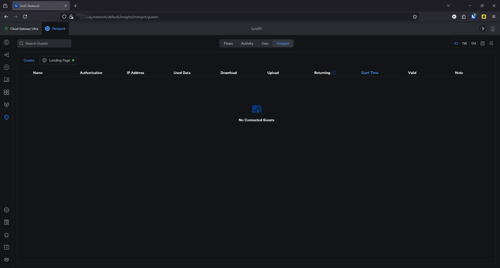
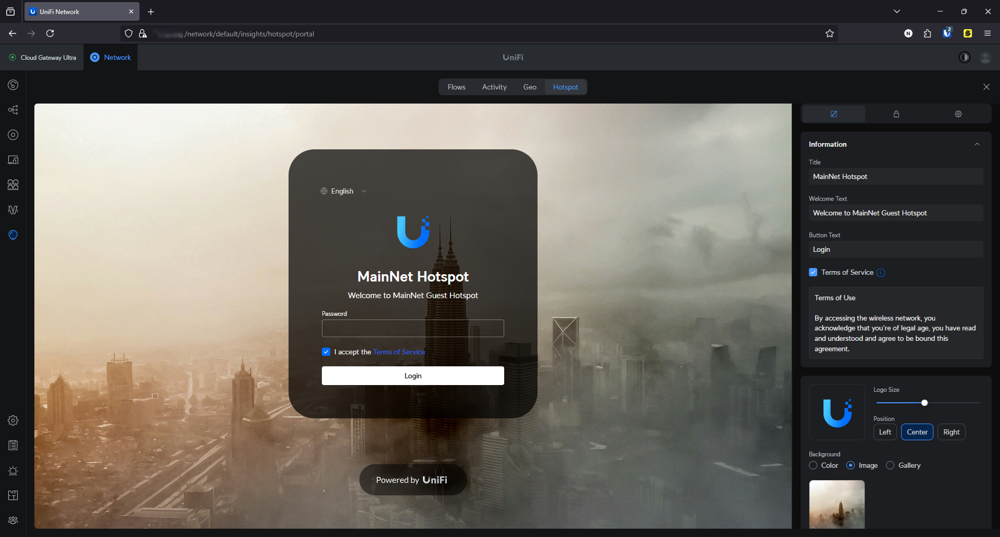
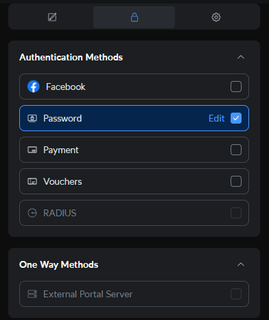
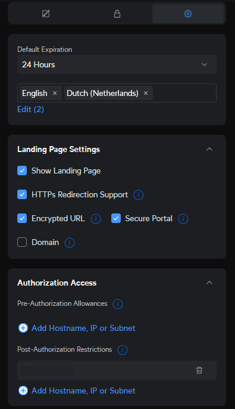

# 📡 Guest Network – Hotspot Configuration

The guest WiFi network in my home lab uses a **UniFi-hosted captive portal (hotspot)** to provide internet access to visitors, while keeping them isolated from the rest of the network.

## 👥 Guest Insights

In the **UniFi Insights > Hotspot** tab, I can monitor:
- Connected guests (name, IP, start time)
- Authorization method used
- Used/download/uploaded data
- Session duration and returning users

---

## 🎨 Custom Landing Page

The hotspot landing page includes custom branding for a polished user experience:
- Title: `MainNet Hotspot`
- Welcome message: `Welcome to MainNet Guest Hotspot`
- Custom button text ("Login")
- Terms of service (editable)
- Optional image background and logo placement

---

## 🔐 Authentication Method

Currently, I use **Password-only** authentication to keep access easy for guests:
- No accounts, no apps — just a single password.
- Alternatives include Facebook login, paid access, voucher codes, or RADIUS.

---

## ⚙️ Portal Configuration

I’ve kept portal settings simple:
- Language: Dutch + English
- Redirects to HTTPS
- Encrypted portal link
- Session expiration: 24 hours
- Basic restriction to prevent access to internal (native) network

