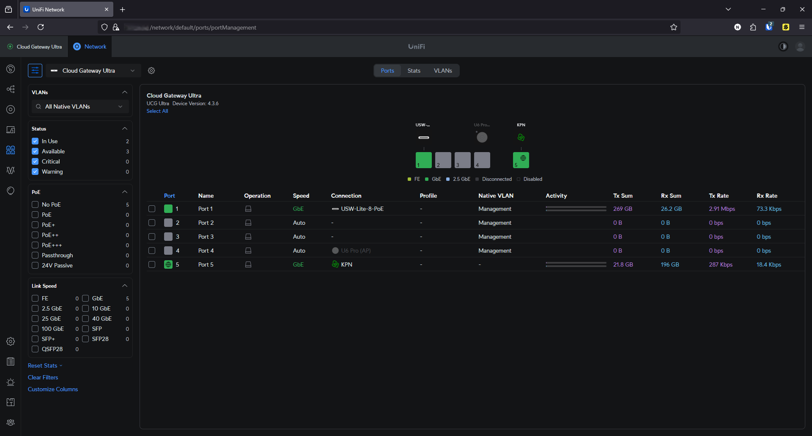
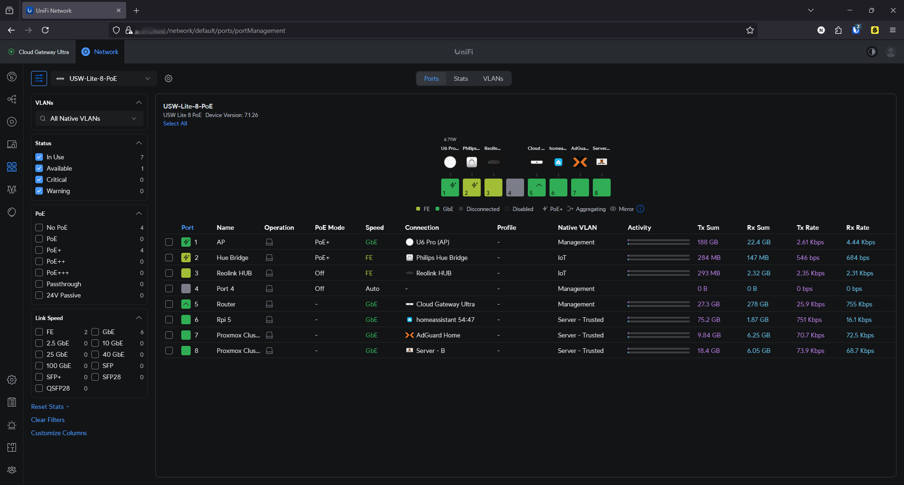
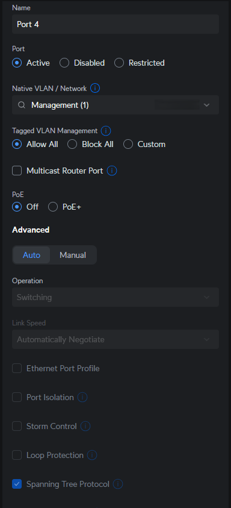

# 🔌 Port Configuration – Cloud Gateway Ultra & USW Lite 8 PoE

This document explains how I configured port profiles and assignments in my homelab setup using UniFi’s network management platform. It covers both the **Cloud Gateway Ultra (CGU)** and the **USW Lite 8 PoE switch**, including their connections, port roles, VLAN assignments and PoE usage.

---

## 🧩 Topology Overview

The **Cloud Gateway Ultra** is the parent device of the **USW-Lite-8-PoE (switch)**. The **USW-Lite-8-PoE** is in turn the parent of the **U6 Pro Access Point**.

Each device has a specific number of physical ports and roles configured in the UniFi interface:

- **CGU:** 5 ports (only port 1 and 5 currently in use)
  - Port 1: Connection to USW Lite 8 PoE
  - Port 5: WAN uplink from ISP modem

 

- **USW Lite 8 PoE:** 8 ports (ports 1–4 are PoE+ capable)
  - Port 1: Access Point (U6 Pro)
  - Port 2: Philips Hue Bridge
  - Port 3: Reolink HUB
  - Port 5: Upstream to CGU
  - Port 6: Raspberry Pi 5 (Home Assistant)
  - Port 7–8: Proxmox Cluster nodes
  

---

## ⚙️ Port Configuration Options

Each port can be configured with detailed options in UniFi’s port management menu.

- **Port name:** Set a recognizable label
- **Native VLAN/Network:** Assign a default VLAN (e.g., Management, IoT)
- **Tagged VLANs:** Choose whether to allow/block all or customize allowed VLANs
- **PoE Mode:** Enable/disable PoE+ (if applicable)
- **Spanning Tree Protocol:** Enabled for loop prevention

---

## 🔌 Example: Port Assignments

| Port | Device/Use         | Native VLAN      | PoE Mode | Notes                             |
|------|---------------------|------------------|----------|------------------------------------|
| 1    | U6 Pro AP           | Management       | PoE+     | WiFi Access Point                  |
| 2    | Hue Bridge          | IoT              | PoE+     | Smart lighting                     |
| 3    | Reolink HUB         | IoT              | Off      | IP camera bridge                   |
| 5    | Gateway upstream    | Management       | Off      | Uplink to Cloud Gateway Ultra      |
| 6    | Raspberry Pi 5      | Server - Trusted | Off      | Running Home Assistant             |
| 7–8  | Proxmox Cluster     | Server - Trusted | Off      | Infrastructure & monitoring tools  |

Note: Some ports (like Port 4) are currently unused or reserved for future expansion. PoE is disabled if the device doesn’t need it.

---

## 🧪 Still to Explore

I plan to explore tighter integration of port profiles with **firewall policies** and **device isolation** (see [`firewall.md`](./firewall.md)) to enhance segmentation and security in the future.

