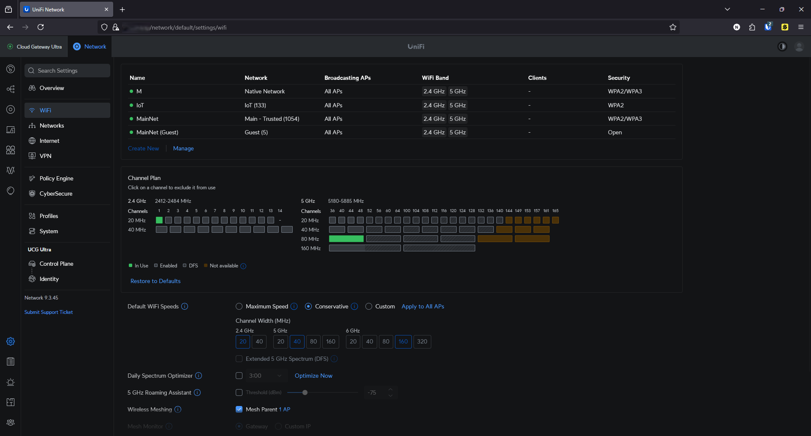
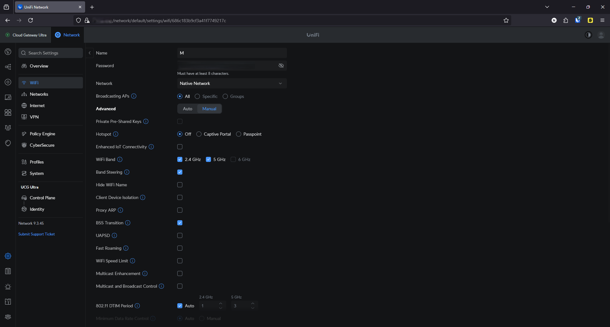

# 📡 SSID Configuration – UniFi Wi-Fi Setup

This document explains how I configured my SSIDs to integrate with my VLAN-based segmented network. Each SSID is assigned to a specific VLAN and secured appropriately.

  
*Overview of configured SSIDs in UniFi*

## 📶 SSID Overview

| SSID Name        | VLAN              | Security       | Visible | Purpose                         |
|------------------|-------------------|----------------|---------|----------------------------------|
| M                | Management (1)    | WPA2/WPA3      | ❌ No  | Admin access from laptop        |
| IoT              | IoT (133)         | WPA2           | ❌ No   | Wireless smart devices          |
| MainNet          | Main - Trusted (1054)| WPA2/WPA3  | ✔️ Yes  | Trusted personal/work devices   |
| MainNet (Guest)  | Guest (5)         | Open + Captive Portal | ✔️ Yes  | Visitor internet access         |

---

## 🔧 SSID Configuration Details

### 🛠️ `M` (Management SSID)
- VLAN: 1
- Purpose: For quick wireless access to UniFi admin interface
- Security: **WPA2/WPA3 hybrid**
- Band Steering: ✅ Enabled (for better performance)
- Broadcast: ❌ Hidden SSID

Used on my laptop to manage UniFi devices without needing Ethernet.

---

### 📡 `IoT`
- VLAN: 133
- Purpose: For smart home devices without Ethernet support
- Security: **WPA2 only**
- Broadcast: ❌ Hidden SSID
- Features:
  - ✅ Enhanced IoT Connectivity
  - ✅ IGMP Snooping
  - ❌ Client-to-client communication (isolated)

Devices include:
- Smart lights (Philips Hue, Govee)
- Video doorbell camera
- Google Home, smart speakers
- Samsung smart fridge & TV
- IPTV box

---

### 💻 `MainNet`
- VLAN: 1054
- Purpose: Main SSID for trusted clients
- Devices: phone, personal laptop, work laptop
- Security: **WPA2/WPA3 hybrid**
- Band Steering: ✅ Enabled
- Broadcast: ✅ Visible

These devices have full internet access but are restricted from management and server zones via firewall rules.

---

### 🌐 `MainNet (Guest)`
- VLAN: 5
- Purpose: Guest access for home visitors
- Security: **Open + Captive Portal**  
  (see [`hotspot-config.md`](./hotspot-config.md))
- Broadcast: ✅ Visible

Guests are fully isolated and can only access the internet. Devices connected here cannot reach other VLANs or internal resources.

  
*Detailed SSID settings including band selection and visibility*
