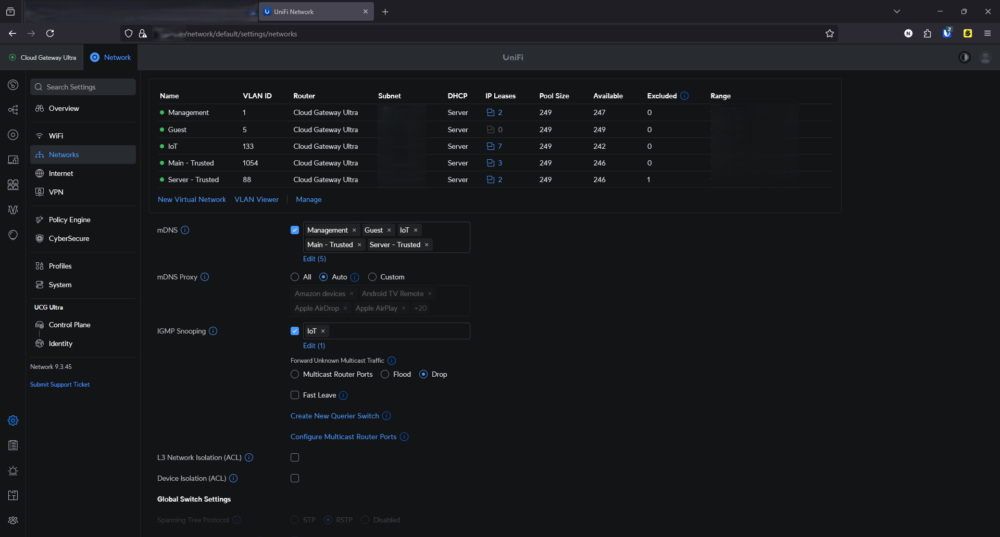
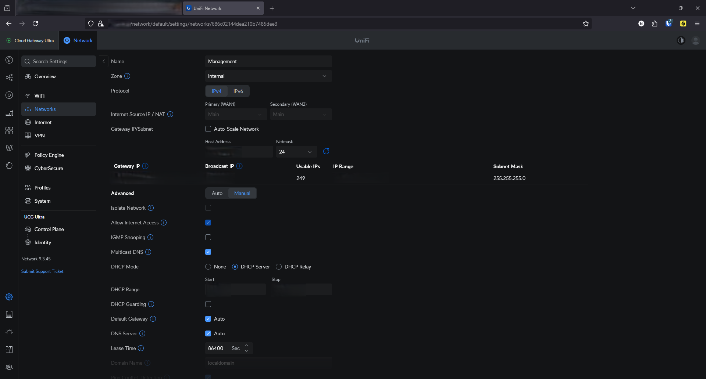

# 🧱 VLAN Configuration

This document outlines the VLAN structure of my segmented homelab network.

  
*VLAN list as configured in UniFi*

## 🧮 Subnet Planning

I use a custom subnetting layout instead of the default `192.168.x.x` ranges.  
To plan my subnets, I used the [IP Subnet Calculator](https://www.calculator.net/ip-subnet-calculator.html).

## 🌐 VLAN Overview

My network is segmented into five VLANs:

| Name            | VLAN ID | Purpose                |
|-----------------|---------|------------------------|
| Management      | 1       | UniFi & admin devices  |
| Guest           | 5       | Guest internet access  |
| IoT             | 133     | Smart home devices     |
| Main – Trusted  | 1054    | Personal & work devices|
| Server – Trusted| 88      | Infrastructure & services|

These VLANs are configured in UniFi and assigned to specific switch ports and SSIDs.
See:
- [`ports.md`](./ports.md)
- [`ssid.md`](./ssid.md)

Devices that connect to a port or SSID associated with a VLAN automatically receive an IP address in the corresponding subnet via DHCP.  
For most devices, I assign a **static IP** once the address is known.

  
*Example of subnet/IP configuration for a VLAN*

---

## 🔐 VLAN Breakdown

### 🛠️ Management (VLAN 1)
Used only for UniFi devices and administrative access.

- DHCP: enabled
- Devices: UniFi Cloud Gateway Ultra, Switch Lite, APs
- Internet access: yes
- Isolation: no (trusted internal)

---

### 🧳 Guest (VLAN 5)
This is an **isolated VLAN** for guests in my home.

- Access to internet only
- Devices cannot see each other
- Managed via UniFi Guest Hotspot (see [`hotspot.md`](./hotspot.md))
- IGMP Proxy: off

---

### 📶 IoT (VLAN 133)
All IoT and smart home devices connect here.

- Devices: smart lights, smart TVs, IPTV, fridge, Google Home, video doorbell, Philips Hue, IKEA bridge
- IGMP Snooping: enabled
- Multicast DNS: active for discovery (e.g., AirPlay, Google Cast)

**What is IGMP Snooping?**  
It allows the switch to listen to IGMP traffic and forward multicast traffic only where needed. This improves efficiency for devices like smart TVs and IP cameras that use multicast for discovery or streaming.

---

### 💼 Main – Trusted (VLAN 1054)
For devices I trust with **personal data and credentials**.

- Devices: phone, personal laptop, work laptop
- Internet: yes
- No access to: management, server VLANs

The devices here are not admin tools, but they are allowed to use services like DNS, VPN, and browsing.

---

### 🖥️ Server – Trusted (VLAN 88)
This is where infrastructure lives.

- Devices: Proxmox cluster, Home Assistant, Docker nodes, Wazuh, Grafana
- Internal-only or highly restricted internet access
- VLAN has inter-VLAN rules to accept incoming management/admin access

  ---

> **See also:**
> - [`ports.md`](./ports.md) for VLAN assignments on switch/router ports  
> - [`ssid.md`](./ssid.md) for VLAN assignments per Wi-Fi SSID  
> - [`firewall.md`](./firewall.md) for inter-VLAN traffic rules
