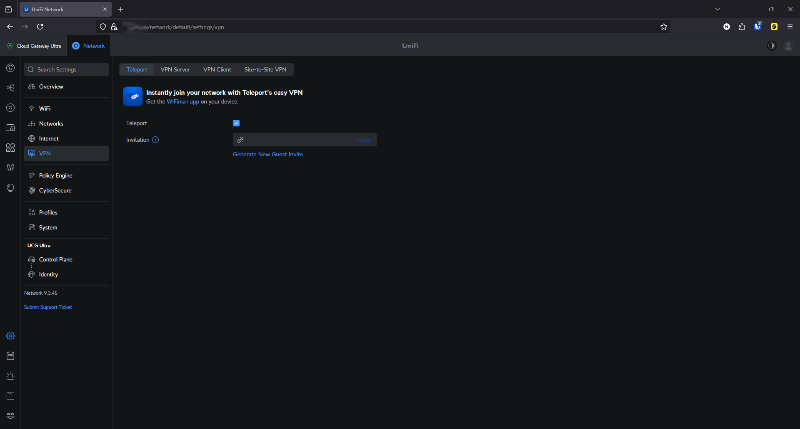
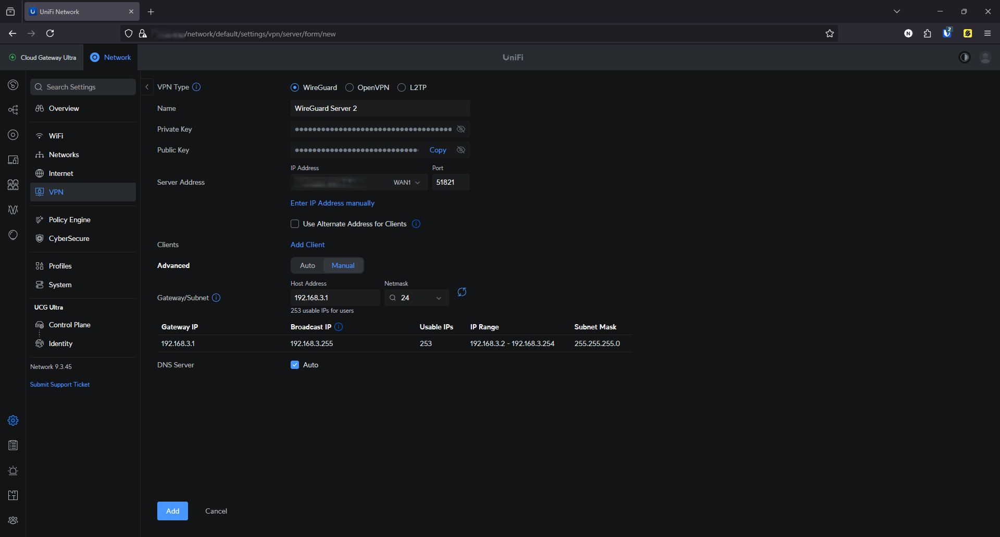
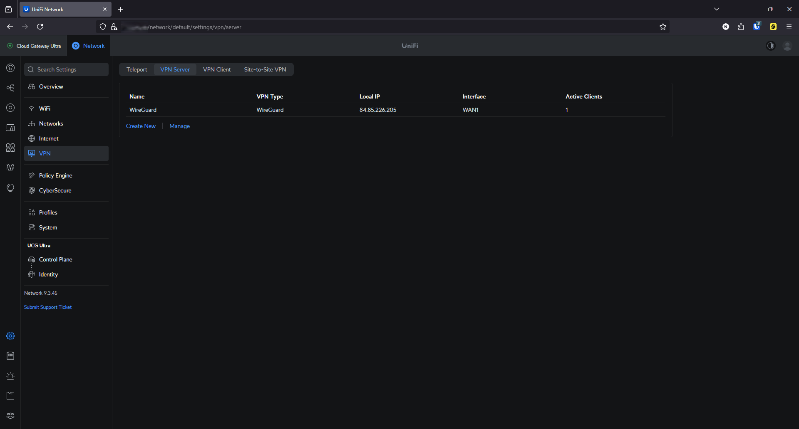

# 🔐 Remote Access VPN – Teleport & WireGuard

This document explains how I configured remote VPN access for my homelab using both UniFi's Teleport feature and a custom WireGuard VPN server.

---

## 🌍 Previous Setup – UniFi Teleport

Teleport is UniFi's built-in VPN solution, designed to be simple and fast to deploy.

### 🟢 Advantages:
- Extremely easy to set up
- Just generate an **invitation link** and paste it into the **WiFiman** app (mobile or desktop)
- One-click access to your home network from remote devices

### 🔴 Downsides I experienced:
- The connection was **unstable** when using Wi-Fi or mobile hotspots (especially on laptops)
- It worked reliably only on **wired connections**
- Limited options for configuration or control

---

## 🛡️ Planned Setup – WireGuard VPN Server

I am currently experimenting with setting up a **WireGuard VPN server** via the UniFi Cloud Gateway Ultra interface.

The screenshot below shows an **example configuration** I was preparing:

- **VPN type**: WireGuard
- **Interface**: WAN1
- **Port**: 51821 (example)
- **Client subnet**: `192.168.3.0/24` (planned range)
- **DNS**: Inherited from WAN
- **Clients**: Planned usage: laptop + phone

> ⚠️ This VPN is **not yet fully configured or in production** — it is a planned upgrade for more stable and configurable remote access.

The setup is meant to replace Teleport, which was too unstable for my use case when connected via Wi-Fi or mobile hotspots.

---

## 🔐 Why I switched:
- I needed **more stability and speed** during remote SSH sessions
- WireGuard has a **stronger connection** than Teleport on mobile networks
- Future plans include assigning **per-client firewall rules** and **specific VLAN access**
