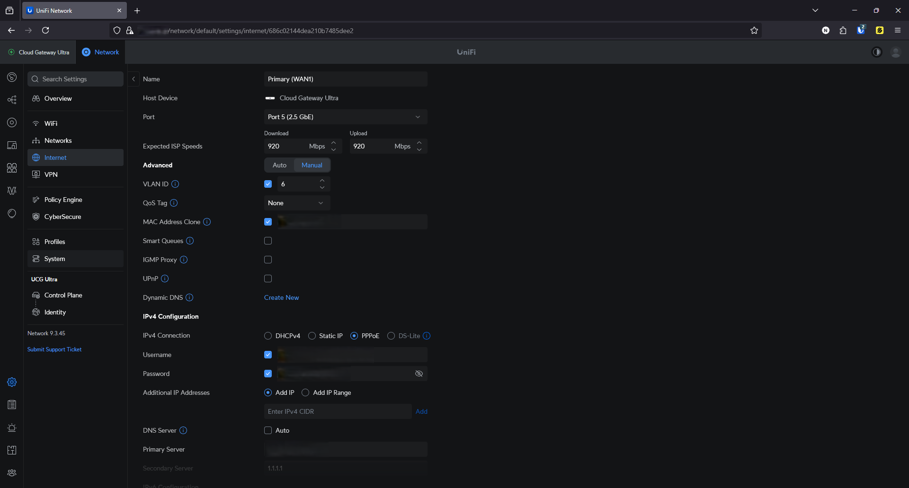

# 🌐 WAN Setup – UniFi Cloud Gateway Ultra

This document describes how the primary WAN interface of my UniFi Cloud Gateway Ultra is configured to connect to the internet via my ISP's modem.

## 🧩 Physical Setup

An Ethernet cable runs from the **modem provided by my ISP** to **Port 5** on my UniFi Cloud Gateway Ultra. Port 5 is configured as the **primary WAN port**.

## 🔁 MAC Address Cloning & VLAN ID

To allow the UniFi Cloud Gateway Ultra to be recognized and accepted by my ISP’s modem, I had to:

- **Clone the MAC address** of the original ISP-provided router
- **Set VLAN ID to 6**, as required by the ISP (KPN) to tag internet traffic correctly

Without this configuration, the modem would not authorize the UniFi device.

## 🌐 IP Stack

- **IPv4 only** is currently enabled.
- In the future, I plan to enable **IPv6** once my internal network and DNS configuration are ready for dual stack.

## 🔑 PPPoE Configuration

My ISP delivers IPv4 connectivity over IPv6 using **PPPoE**.

- **Connection type**: PPPoE (Point-to-Point Protocol over Ethernet)
- **Username and password**: Extracted from the ISP’s admin portal
- This setup is required to receive a public IPv4 address.

## 🧠 DNS Configuration

- **Primary DNS**: Local AdGuard instance at `<IP host>`  
- **Secondary DNS**: Cloudflare (`1.1.1.1`)

## 🖥️ Summary of Key Settings

| Setting                | Value                   |
|------------------------|-------------------------|
| WAN Port               | Port 5 (2.5 GbE)        |
| VLAN ID                | 6                       |
| MAC Clone              | Enabled                 |
| IP Version             | IPv4 (PPPoE)            |
| DNS (Primary)          | AdGuard (`IP host`) |
| DNS (Secondary)        | Cloudflare (`1.1.1.1`)  |

---

> _See also_:  
> - [firewall.md](./firewall.md) for security rules applied to WAN  
> - [vpn.md](./vpn.md) for remote access setup

