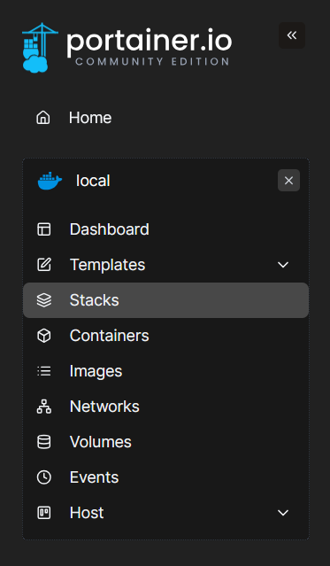
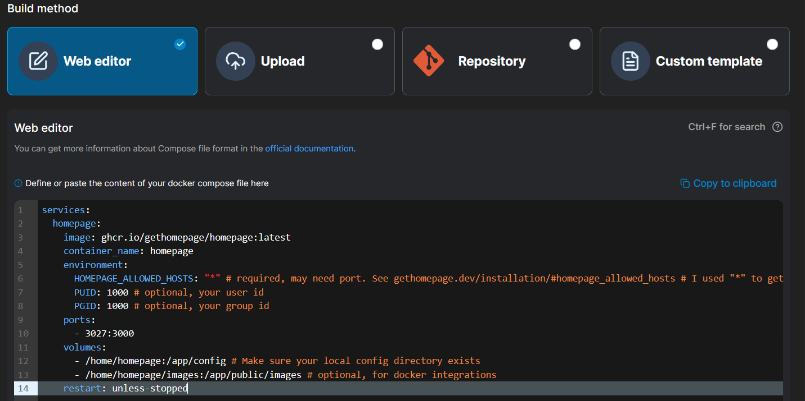
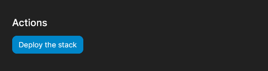

# 🧱 Installing Homepage via Portainer

This file explains how I installed [Homepage](https://gethomepage.dev/) as a Docker container using **Portainer Stacks**.

---

## 🔧 Steps to Install Homepage with Portainer

1. **Go to your Portainer environment**  
   This is where all your Docker containers and stacks are running.

2. **Navigate to** `Stacks`
  
   

3. **Click on** `+ Add Stack`
  
   

4. **Configure the stack:**

   - Choose a recognizable name (I used `homepage`)
   - Select **Web editor** as your build method 

5. **Paste the [`compose.yaml`](./yaml/compose.yaml) content** into the editor.  
   This YAML defines how Homepage should run (ports, volumes, restart policy, etc.)

   

6. **Scroll to the bottom and click** `Deploy the stack`
  
   

---

## 🚀 Result

- Portainer creates a new **Docker Stack** and a corresponding **container** running Homepage.
- You can monitor the logs or just visit the site to test the deployment.

If you followed my exact `compose.yaml`, you can visit Homepage via:
`http://<your-portainer-ip>:3027/`

Replace `<your-portainer-ip>` with the IP address of your Docker host.

You’ll now see the default **Homepage dashboard** running!

---

>🔄 Next Step
>
>📁 [config-homepage.md](config-homepage.md)
