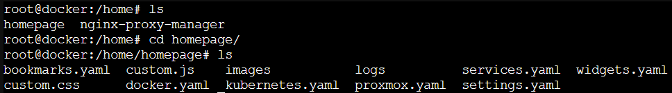

# 🧱 Installing Homepage via Portainer

This file explains how I installed [Homepage](https://gethomepage.dev/) as a Docker container using **Portainer Stacks**.

---

## 📁 Preparation Before Installation

Before deploying the Homepage stack, I created the necessary folders inside my LXC container to properly mount configuration and image paths via Docker volumes.

These directories are required so that Homepage stores its config files in a known location and optionally allows you to use custom background images.

---

## 🧾 Terminal Steps

1. Open the shell of your LXC container via **Proxmox**.
2. Navigate to the home directory:

```bash
cd /home
```

3. Create a central folder for Homepage:

```bash
mkdir homepage
```

This creates the path:

```text
/home/homepage
```

This directory will be used to store configuration files like:
- bookmarks.yaml
- widgets.yaml
- services.yaml
- settings.yaml

4. (Optional) Create an `images` folder inside the `homepage` folder to store custom dashboard backgrounds:

```bash
cd /home/homepage
mkdir images
```

Which results in:

```text
/home/homepage/images
```



>💡 Note
>
> Make sure that these exact volume paths are used in your `docker-compose.yaml` under the `volumes:` section.  
> Without them, Homepage won’t store or persist its configuration properly.

---

## 🔧 Steps to Install Homepage with Portainer

1. **Go to your Portainer environment**  
   This is where all your Docker containers and stacks are running.

2. **Navigate to** `Stacks`
  
   

3. **Click on** `+ Add Stack`
  
   

4. **Configure the stack:**

   - Choose a recognizable name (I used `homepage`)
   - Select **Web editor** as your build method 

5. **Paste the [`docker-compose.yaml`](./yaml/docker-compose.yaml) content** into the editor.  
   This YAML defines how Homepage should run (ports, volumes, restart policy, etc.)

   

6. **Scroll to the bottom and click** `Deploy the stack`
  
   

---

## 🚀 Result

- Portainer creates a new **Docker Stack** and a corresponding **container** running Homepage.
- You can monitor the logs or just visit the site to test the deployment.

If you followed my exact `compose.yaml`, you can visit Homepage via:
`http://<your-portainer-ip>:3027/`

Replace `<your-portainer-ip>` with the IP address of your Docker host.

You’ll now see the default **Homepage dashboard** running!

---

>🔄 Next Step
>
>📁 [config-homepage.md](config-homepage.md)
