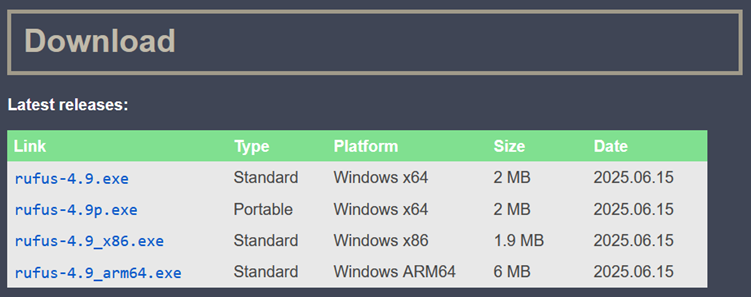
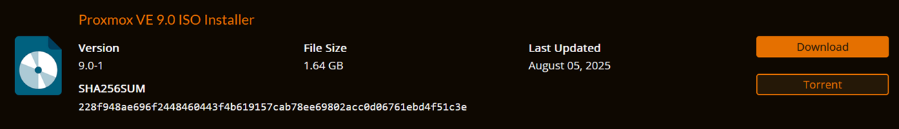
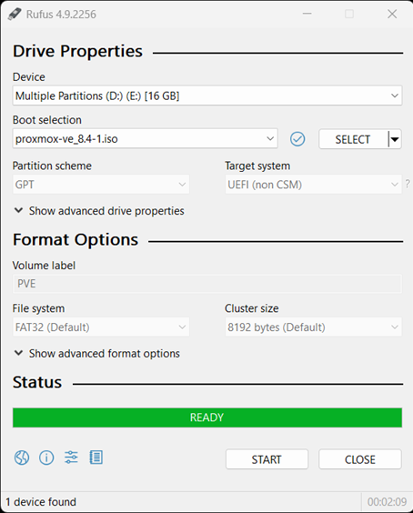

# 💾 Create a Proxmox USB Installer

This document outlines the process I followed to create a bootable USB installer for Proxmox VE using [Rufus](https://rufus.ie/en/) on a Windows machine.

---

## 📥 Download Required Files

Before starting, I downloaded the following tools:

- **Rufus** (USB flashing utility) from the [official Rufus website](https://rufus.ie/en/)
  - I selected: `rufus-4.9.exe`  
    (Standard version, Windows x64, ~2MB)

- **Proxmox VE ISO** from the [official site](https://www.proxmox.com/en/downloads)
  - Version: **9.0**
  - Size: **1.64 GB**

---

## 🔧 Create Bootable USB with Rufus

Once both files were downloaded:

1. Inserted a USB flash drive (minimum 8GB recommended).
2. Opened **Rufus** and selected the correct USB device.
3. Clicked **SELECT** and chose the `proxmox-ve_9.0-1.iso` file.
4. Left all default options:
   - **Partition scheme**: GPT
   - **Target system**: UEFI (non-CSM)
   - **File system**: FAT32
   - **Cluster size**: 8192 bytes (default)
5. Pressed **START** and confirmed any prompts.

After a few minutes, the USB installer was successfully created and ready to use on bare-metal hardware.

---

## ✅ Result

I now have a bootable flash drive that can be used to install **Proxmox VE 9.0** on physical systems for my homelab environment.

---

> ➡️ **Next step:** [installation.md](installation.md) – Installation walkthrough for Proxmox on each machine
