# Creating LXC Containers in Proxmox VE

After the post-installation process and reboot, you are ready to start creating LXC containers and virtual machines.

To simplify the setup process, I primarily use helper scripts, which are also referenced in the [post-install.md](post-install.md) documentation.  
Specifically, I use the advanced installation method with helper scripts to apply my own configuration.  
The same configuration steps performed by those scripts are reflected throughout this documentation.

---

## Creating an LXC Container

To create an LXC container, right-click on the node and select **Create CT**.

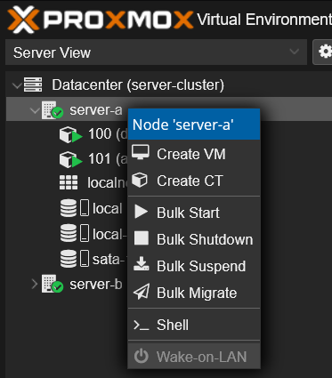

---

### General Configuration

Set the basic options:
- Node: `server-a`
- CT ID: `102`
- Hostname: `lxc-example`
- Password: set a strong password

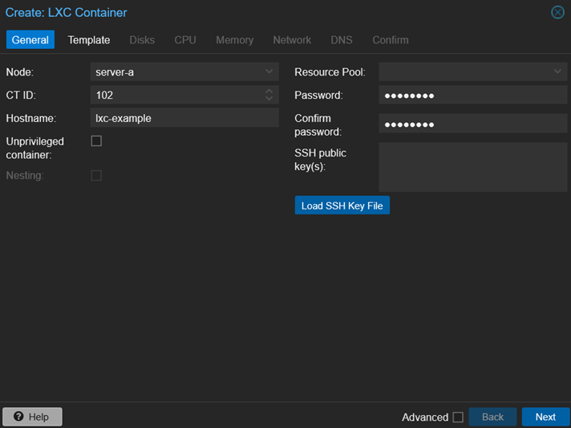

---

### Template

Select your desired template. In this example, we are using Debian 12.

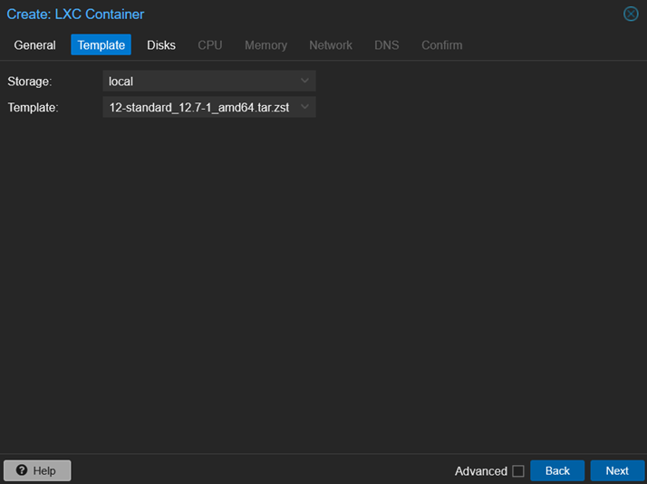

---

### Disks

Choose the storage and disk size for the root filesystem.

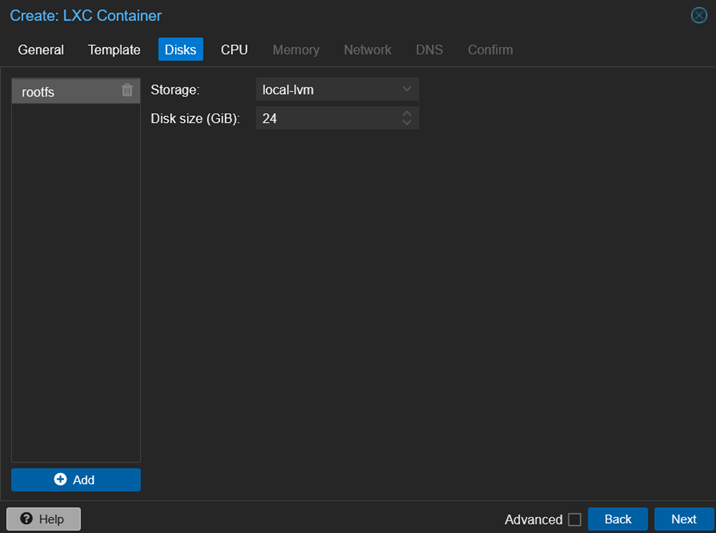

---

### CPU

Assign the number of cores for the container.

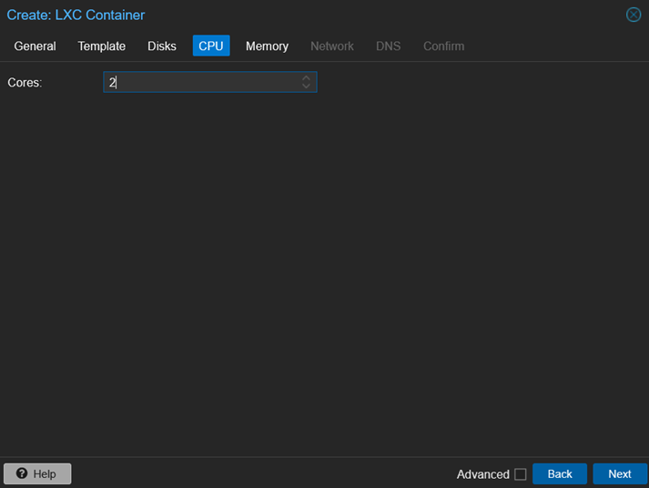

---

### Memory

Configure the memory and swap allocation.

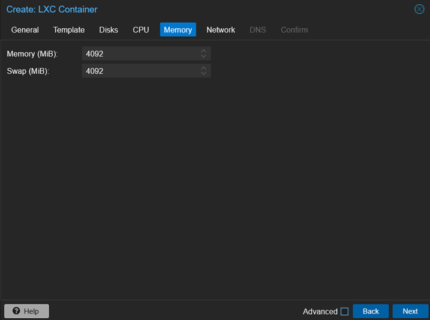

---

### Network

Set the container to use static IP with firewall enabled.

Example configuration:
- IPv4: `196.120.54.99/24`
- Gateway: `196.120.54.1`
- Bridge: `vmbr0`

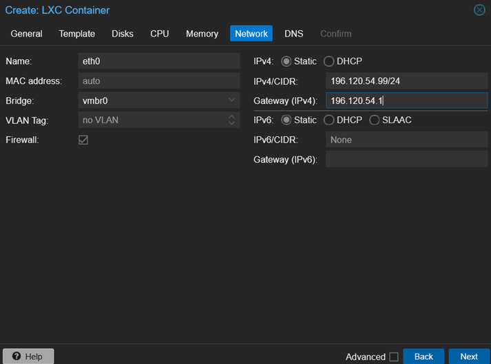

---

### DNS

Leave default or modify if needed.

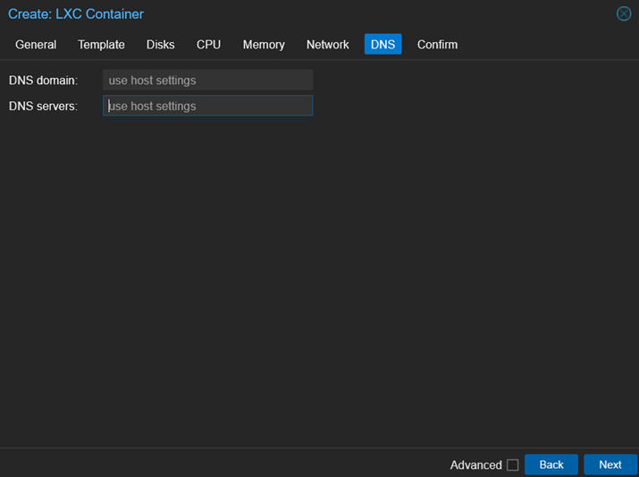

---

### Confirm Settings

Review and confirm all configuration values before creating the container.

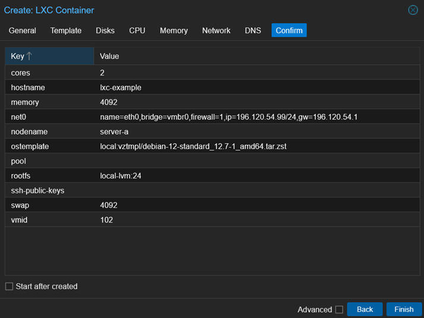

---

### Creation Process

Once confirmed, the container will be created and you will see the status in the task viewer.

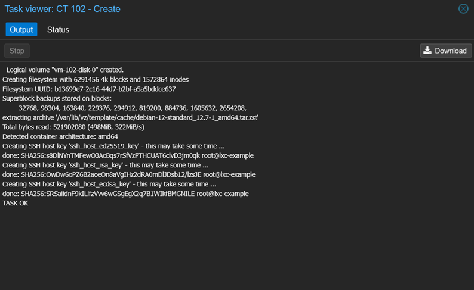

---

### Start and Shell Access

Right-click on the created container (CT 102) and click **Start**, then open **Console**.

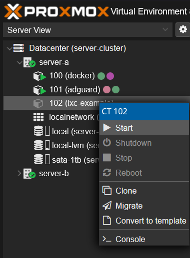

Login with your root credentials to begin configuring the container.

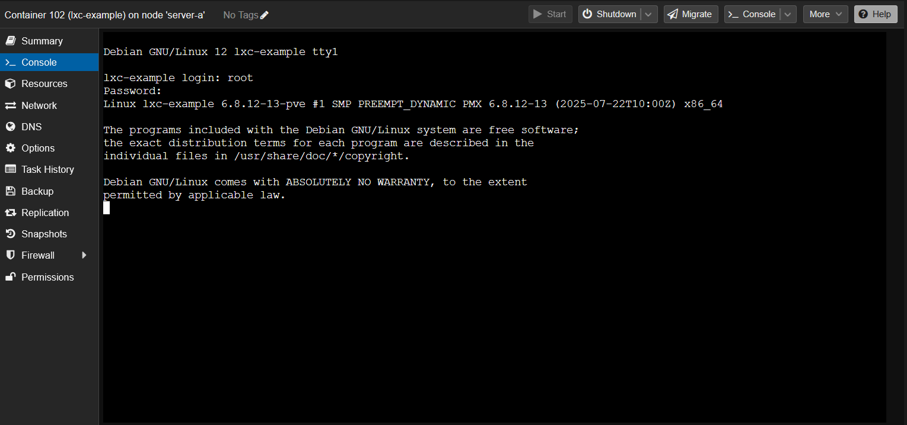

---

## Container Summary

Once started, you can view real-time stats and health of your container.

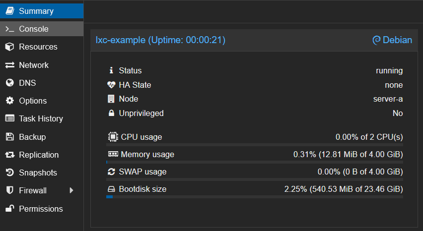

---

➡️ Proceed to next step: [Creating VM](vm.md)
