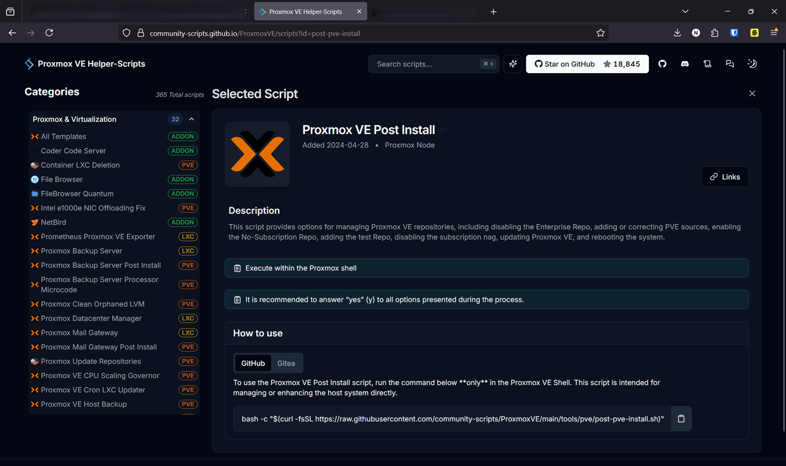
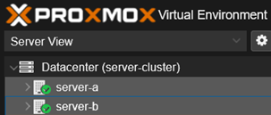
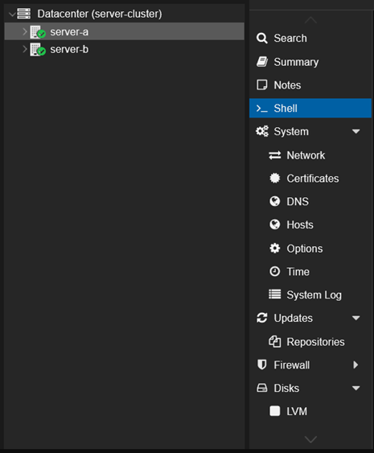
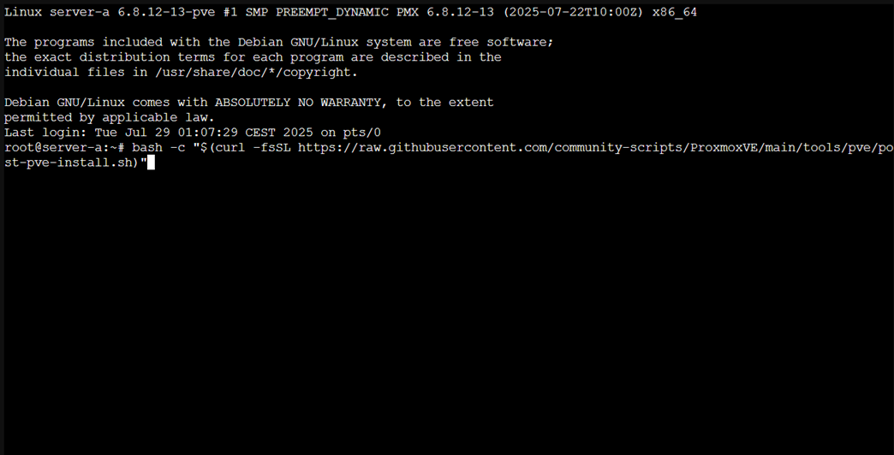
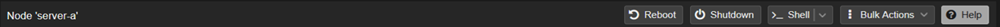

# Post-install: Proxmox VE Setup After Installation

After installing Proxmox VE and accessing the system through the web interface at `https://<IP>:8006`, there are several changes that should be made.

This isn’t my first time setting up Proxmox, so to make my life easier I use a helper script that automates most of these adjustments.

---

## 🔧 Proxmox VE Helper-Scripts

[Proxmox VE Helper-Scripts](https://community-scripts.github.io/ProxmoxVE/) is a toolkit that allows you to perform many tasks within Proxmox through shell-based scripts that also provide a UI interface.

It includes functionality like:
- Starting LXC containers (e.g., Pi-hole)
- Deploying VMs (e.g., Nextcloud)
- Installing PVE tools and add-ons
- Tuning configurations and repositories

In this documentation I am only going to use the [**Proxmox VE Post Install** helper script](https://community-scripts.github.io/ProxmoxVE/scripts?id=post-pve-install).



> 🔎 I highly recommend browsing the list of available scripts on the site. It’s a valuable toolbox.

---

## 🖥️ How to Open the Shell

1. In the Proxmox UI, click on the correct node in the sidebar (e.g., `server-a`)

 

2. Then choose `Shell` from the top-right menu or the left navigation panel
 


---

## 🚀 Using the Post-Install Script

To execute the script, copy the following line into the shell of the node you want to configure:

```bash
bash -c "$(curl -fsSL https://raw.githubusercontent.com/community-scripts/ProxmoxVE/main/tools/pve/post-pve-install.sh)"
```



---

## 🧠 What the Script Does (Simplified Overview)

Once the script runs, it brings up a terminal UI.  
Use:
- **SPACE** to select options
- **ENTER** to confirm selections

Then, the script will:
- ✅ Correct APT sources to use standard Debian ones
- ✅ Ask if you want to disable the enterprise repo (recommended if you don’t have a paid license)
- ✅ Ask if you want to enable the no-subscription repo (recommended for free users)
- ✅ Configure Ceph repos (optional; for storage clusters)
- ✅ Ask if you want to enable the `pvetest` repo (not recommended for production and for less advanced Proxmox VE users)
- ✅ Ask if you want to disable the subscription nag popup
- ✅ Ask if you want to configure High Availability (HA)
- ✅ Ask if you want to update the Proxmox system (`apt update && apt dist-upgrade`)

---

## 📝 Personal Note

Although the script is handy, I prefer to know what it’s doing under the hood.  
That’s why I always double-check whether:
- All updates have been applied
- Repositories are correctly set up
- Any manual adjustments are still needed

---

## 🔄 Rebooting the Node

When done, I reboot the node via the UI:
1. Click the node name (e.g. `server-a`)
2. Use the `Reboot` button in the top-right corner


